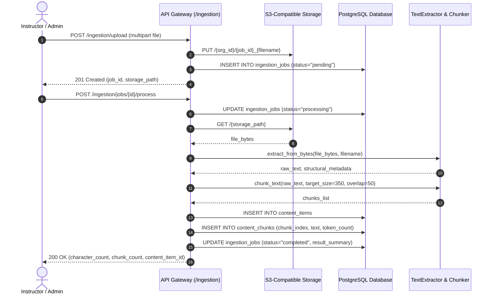
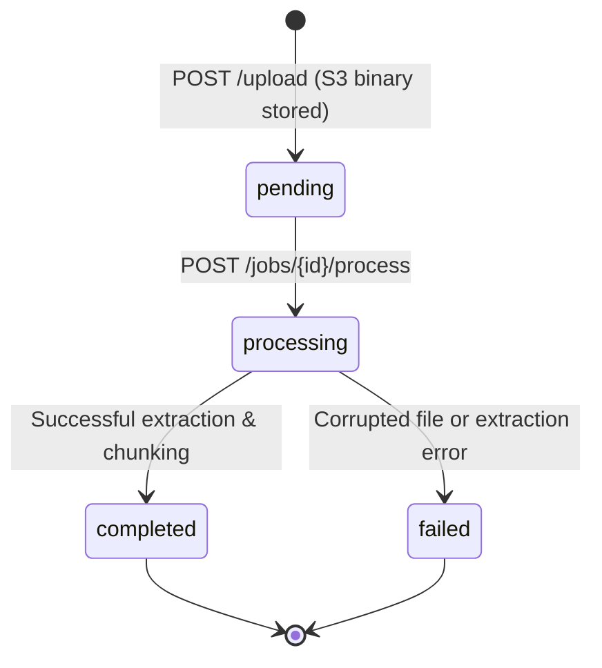

# Content Ingestion Architecture & Pipeline

> **Adaptive LMS with Deep Reporting AI**  
> Multi-Format Ingestion, S3 Persistence, Text Extraction, and Semantic Chunking Specification.

---

## 1. Pipeline Overview

---

## 2. Supported Formats & Parsing Strategies

| Format | Extensions | Parser Engine | Extraction Strategy & Metadata Extracted |
| :--- | :--- | :--- | :--- |
| **PDF Documents** | `.pdf` | PyMuPDF (`fitz`) / `pypdf` | Multi-page text streams, page count, formatting preservation. |
| **Word Documents** | `.docx`, `.doc` | `python-docx` | Structured paragraph ordering, embedded tables text extraction. |
| **PowerPoint Presentations** | `.pptx`, `.ppt` | `python-pptx` | Slide-by-slide shape traversal, speaker notes, titles. |
| **Audio & Video Assets** | `.mp3`, `.mp4`, `.wav`, `.m4a` | OpenAI Whisper / Speech Pipeline | Timecoded speech-to-text transcript segments. |
| **Plain Text & Markdown** | `.txt`, `.md`, `.markdown` | Python UTF-8 stream | Native character stream extraction, heading tags. |

---

## 3. Semantic Chunking Strategy

Documents are processed using `SemanticChunker`:
- **Target Chunk Size:** 350 tokens (~270 words).
- **Chunk Overlap:** 50 tokens (~38 words) to maintain semantic continuity across chunk boundaries.
- **Boundary Preservation:** Chunks honor paragraph breaks (`\n\n`) and sentence boundaries before resorting to word-level splits.
- **Storage Target:** Persisted in `content_chunks` table linked to parent `content_items` with indexed `(content_item_id, chunk_index)`.

---

## 4. Ingestion Job Lifecycle

---

## 5. Security & Isolation Guarantees

1. **Tenant-Scoped Storage Paths:** S3 objects are isolated under `{org_id}/{job_id}_{filename}` prefixes.
2. **Access Control:** Content upload and processing endpoints strictly require `instructor` or `org_admin` roles. Standard learners attempting uploads receive `403 Forbidden`.
3. **Audit Trails:** All ingestion operations write compliance audit entries to `audit_logs` (`CONTENT_FILE_UPLOADED`).
