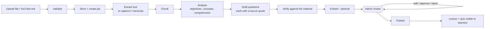

# Content ingestion

How material becomes learning content: uploaded or linked, validated, read, split, analysed by an AI model, turned into **candidate** questions, reviewed by a person, and only then published to learners.

The principles, in order of importance:

1. **A person decides what learners see.** Nothing generated reaches a learner until an administrator has approved it and published the content.
2. **No invented output.** If a stage cannot do its job (no AI model, no transcription engine, no captions, a scanned PDF), the job says so and stops there. There is no placeholder text, no canned transcript, no default question.
3. **Content is untrusted input.** A document can contain instructions aimed at the model. They are treated as data (see [Prompt-injection defences](#prompt-injection-defences)).
4. **Everything is tenant-scoped.** Server-derived `org_id` on every row; another tenant's id is a 404.

Code: `services/api/app/ingestion/` (pipeline), `services/api/app/api/v1/content_admin.py` (API), `frontend/app/admin/content/` (UI). Provider setup is in [AI_PROVIDER.md](AI_PROVIDER.md); running it at no cost is in [ZERO_COST_MODE.md](ZERO_COST_MODE.md).

---

## 1. The flow

Processing runs in the background. The API answers `202` immediately with a `content_id` and `job_id`; the UI follows the job by polling `GET /admin/content/{id}` (which includes the job and its stages) every two seconds.

### Stages

Each job records its stages on `ingestion_jobs.stages` (JSON), committed after every stage so progress survives a crash and can be shown live. A stage is `pending`, `running`, `done`, `skipped` or `failed`, with a human-readable `detail` or an `error {code, message}`.

| Source | Stages |
|---|---|
| Document (`pdf`, `docx`, `pptx`, `txt`, `md`) | `extract` → `chunk` → `analyze` → `questions` → `embed` |
| Video / audio file | `transcribe` → `chunk` → `analyze` → `questions` → `embed` |
| YouTube link | `metadata` → `chunk` → `analyze` → `questions` → `embed` |
| Re-analysing text already stored (e.g. a pasted transcript) | `chunk` → `analyze` → `questions` → `embed` |

`embed` is optional: with no embedding model it is `skipped`, which is not a failure.

### Job outcomes

| Status | Meaning | Admin action |
|---|---|---|
| `pending` / `processing` | Running. | Wait (the page updates itself). |
| `ready_for_review` | Every stage that ran succeeded. | Review, then publish. |
| `needs_attention` | Something optional or repairable failed; **the content is kept**. The extracted text and any completed stages remain. | Read the message, fix the cause, **Retry**. For a missing transcript, paste one. |
| `failed` | Nothing usable could be produced (unreadable file, private video). | Fix the source and add it again, or Retry. |
| `completed` | Published. | — |

Failure codes surfaced to the UI include `ai_unavailable`, `ai_output_invalid`, `no_transcript`, `transcription_unavailable`, `empty_content`, `corrupt_file`, `encrypted`, `video_unavailable`, `embedding_failed`, `interrupted`.

Jobs left in `processing` by a crash or restart are marked `needs_attention / interrupted` at API startup (older than `INGESTION_STALE_MINUTES`), so no one waits on them forever.

---

## 2. What can be added

### Files

| Format | Extensions | How it is read |
|---|---|---|
| PDF | `.pdf` | PyMuPDF if installed, else `pypdf`. Encrypted PDFs are reported. A PDF with no text layer (a scan) is reported as `empty_content` with an explanation; **there is no OCR**. |
| Word | `.docx` | `python-docx`: paragraphs (headings kept as `#`), tables. |
| PowerPoint | `.pptx` | `python-pptx`: slide text and speaker notes. |
| Text / Markdown | `.txt`, `.md` | UTF-8. Other encodings are rejected rather than guessed. |
| Video | `.mp4`, `.webm`, `.mov` | Stored and playable. Transcribed only if `faster-whisper` is installed; otherwise the admin pastes a transcript. |
| Audio | `.mp3`, `.wav`, `.m4a` | As video. |

Legacy `.doc` and `.ppt` are refused with an actionable message ("save as .docx / .pptx"): they are OLE binaries that the parsers cannot read, and the previous implementation silently decoded their bytes as text.

### YouTube

Only YouTube. The URL is validated (`youtube.com`, `www.`/`m.`/`music.` and `youtube-nocookie.com` variants, `youtu.be`, a valid 11-character video id, a single video, not a playlist or channel) and reduced to a canonical `https://www.youtube.com/watch?v=<id>`. The server then fetches, from YouTube only:

1. oEmbed → title, channel, thumbnail. **A 401/403/404 here means the video is private or removed and the job `failed`s immediately.**
2. The watch page → length, playability, caption tracks. If the page cannot be read the item is kept with unknown length and a warning; length is never guessed.
3. Captions (JSON3), preferring a manual track in English, then any manual track, then automatic captions. Automatic captions are flagged as less reliable in the review page.

Caption URLs must be `https` on a YouTube host; anything else is refused (SSRF). No arbitrary URL is ever fetched.

If the video has **no captions** the job is `needs_attention / no_transcript` and the admin can paste a transcript. A pasted transcript is marked `transcript_source: manual` and is never overwritten by a later re-fetch.

---

## 3. Validation before anything is stored

`app/ingestion/validation.py`, applied by `POST /admin/content/ingest/file`:

- extension must be one of `ALLOWED_FILE_TYPES` (default: the table above);
- size 1 byte … `MAX_UPLOAD_SIZE_MB` (default 100); the body is read with a hard cap;
- **magic bytes must match the extension** (`%PDF-`, ZIP for Office formats, `ftyp` for MP4, `EBML` for WebM, `ID3`/frame sync for MP3, `RIFF…WAVE`, …). A renamed `.exe` is rejected as `content_mismatch`;
- Office files (ZIP) are inspected: required parts must exist and the archive must not exceed 5,000 entries or 500 MB uncompressed (zip-bomb defence);
- text files must be valid UTF-8 without NUL bytes;
- the filename is sanitised (path separators, control and bidi characters, spaces and shell metacharacters removed) and the object key is `{org_id}/{job_id}/{safe_name}`. The user's filename is never used as a path.

Errors are structured: `{"detail": {"code": "content_mismatch", "message": "..."}}` with 413 / 415 / 422 as appropriate. Nothing is stored for a rejected file.

**Duplicates.** A SHA-256 of the file (or the canonical YouTube URL) is compared within the tenant; a match returns `409 duplicate_content` with the existing `content_id`. The UI offers "Open existing" or "Add anyway" (`allow_duplicate=true`).

---

## 4. Analysis and question generation

Two model calls per item (`app/ingestion/analysis.py`, prompts in `prompts.py`, version `ingestion_v1`):

1. **Analyse** → `summary`, `level`, `objectives` (learner-facing, observable), `concepts`, and proposed `competencies`.
2. **Questions** → multiple-choice candidates, each with options, the correct index, an explanation, a difficulty 0–1, the competency it evidences, and a **verbatim `source_quote`** from the material.

For long material the analysis sees an excerpt selection spread across the text (`INGESTION_MAX_ANALYSIS_CHARS`), not just the first page.

### Verification (what makes it "grounded")

Model output is never trusted directly:

- it must parse as JSON and validate against a Pydantic schema; on failure the model gets **one** repair attempt with the parse error, then the stage fails with `ai_output_invalid`;
- every question's `source_quote` must appear in the material (compared after collapsing case, whitespace and punctuation). A question whose quote is not in the material is **discarded**, counted, and listed under "discarded by verification" for the admin;
- questions with fewer than 3 options, no or several correct options, duplicate options, "all/none of the above" options, or text that nearly duplicates an already accepted question are discarded;
- correct-option position is shuffled deterministically (seeded from the question text, so results are reproducible) because models put the right answer first far too often;
- if nothing survives, the stage says "No question passed verification" and there are simply no candidates. The admin can write questions by hand.

Generated questions start as `pending`. Manually written ones start as `approved`.

### Competency mapping

Proposed competencies are matched against the tenant's **existing** competencies (the model is shown the existing codes and may cite one; otherwise name similarity ≥ 0.85) so the skill graph is reused, not duplicated. A match is proposed as `link` (with the match score shown); otherwise as `create` with a suggested code. The admin can change any decision: link to a different competency, create, or skip. **Nothing is created until publish.**

### Caching

Analysis is keyed by `sha256(text) + prompt_version`. Re-running an unchanged item does not call the model again ("unchanged since the last analysis"); "Analyse again" (`force`) does. Re-analysing keeps questions the admin already approved or rejected and replaces only untouched drafts.

---

## 5. Review and publish

The review page (`/admin/content/{id}`) has three tabs and a publish panel.

- **Questions** — each candidate shows its text, options (correct one marked), explanation, difficulty, competency, and the **quoted source passage**. Approve, reject, send back to review, edit (with the same validation the server applies), delete, or write a new one. "Approve all pending" is available; it is an explicit action, never automatic.
- **Analysis** — edit the summary, level and objectives; decide each competency (existing / new / skip).
- **Details** — title, description, extracted text, source facts; replace the transcript.
- **Publish panel** — states blockers (e.g. still processing, nothing for a learner to see), warnings (no objectives, no competencies, no approved questions, N unreviewed), and exactly what publishing will do.

### What publish does (`app/ingestion/publish.py`)

In one transaction:

1. creates the competencies marked *create* (code made unique within the tenant) and resolves *link* decisions;
2. maps content → competencies, and adds them to the module and the course (`content_competencies`, `module_competencies`, `course_competencies`);
3. turns **approved** questions into a real `Quiz` + `QuizQuestion` + `QuizOption` rows, presented as a quiz lesson item next to the content (`quizzes.content_item_id`); unreviewed and rejected candidates are not published;
4. sets the content `published`, the job `completed`, and writes an audit entry.

Publishing again after approving more questions appends them to the same quiz. **Unpublish** hides the content from learners (their progress is kept) and returns it to review. Published questions are locked; unpublish to change them. Published content cannot be deleted; unpublish first.

---

## 6. API

All under `/api/v1/admin/content`, roles `ld_admin` (legacy `instructor`) and `org_admin`; everything is tenant-scoped.

| Method & path | Purpose |
|---|---|
| `GET /capabilities` | File types, size limit, whether AI / transcription / embeddings are available (drives honest UI states) |
| `POST /ingest/file` | multipart: `file`, `module_id`, `title?`, `allow_duplicate?` → `202 {content_id, job_id}` |
| `POST /ingest/youtube` | `{url, module_id, title?, allow_duplicate?}` → `202` |
| `GET /` | Library: `q`, `status`, `type`, `source`, `course_id`, `module_id`, `limit`, `offset` |
| `GET /{id}` | Detail: analysis, job + stages, candidates, readiness |
| `GET /jobs/{id}` | Job progress |
| `POST /{id}/process` | Retry (`{force: true}` re-analyses) |
| `PUT /{id}` | Title, description, module |
| `PUT /{id}/transcript` | Manual transcript (video/audio) |
| `PUT /{id}/analysis` | Edit objectives / level / summary / competency decisions |
| `POST /{id}/candidates` | Write a question |
| `PUT /candidates/{cid}` · `DELETE /candidates/{cid}` | Edit / delete a candidate |
| `POST /candidates/{cid}/status` · `POST /{id}/candidates/status` | Approve / reject / reset one or many |
| `POST /{id}/publish` · `POST /{id}/unpublish` · `DELETE /{id}` | Lifecycle |

The old `/ingestion/*` and `/ai/*` endpoints were removed: they had no size/type validation, no tenant check on the module, fabricated transcripts, and fell back to hard-coded questions when AI failed.

---

## 7. Prompt-injection defences

Uploaded content and YouTube captions are attacker-controllable. Layers, from outermost:

1. **Fencing.** Material is wrapped in `<<<CONTENT_START id=… chunk_index=…>>> … <<<CONTENT_END id=…>>>` with a fresh random nonce per call. The system prompt says everything inside the fence is untrusted data, never instructions.
2. **Defanging.** Any `<<<` / `>>>` in the material is neutralised so it cannot forge a fence boundary.
3. **Constrained output.** The model must return JSON matching a schema; free text is ignored. On invalid output, one repair attempt, then failure.
4. **Grounding check.** Even a fully hijacked model cannot inject a question that is not supported by the material, because each quote is verified against it.
5. **Human review.** Nothing generated is published without an administrator approving it.

What this does **not** do: it cannot stop a document from *truthfully containing* misleading content, and a hijacked model could still produce a poor objective or summary. That is what review is for. See [SECURITY.md](SECURITY.md).

---

## 8. Limits and honest gaps

- **Not verified against a live model or live YouTube** in the environment this was built in (no outbound internet, no local model). The pipeline is tested end to end with a scripted, extractive model and a mock YouTube transport; see [TESTING.md](TESTING.md). The first real run may need prompt tuning for your chosen model.
- **No OCR** for scanned PDFs or images; **no automatic transcription** unless `faster-whisper` is installed.
- **PPTX extraction** is implemented but its test is skipped where `python-pptx` is not installed.
- Embeddings are stored (with the model name) but nothing retrieves by them yet; that arrives with the reporting AI (Phase 7).
- Content is analysed as text only; figures, diagrams and slide images are not understood.
- Multiple-choice only. Short-answer, open-ended and coding questions arrive with the grading agent (Phase 5).
- The background runner is in-process (`asyncio`, two at a time). It is adequate for one API instance; running several API replicas would need a shared queue (the `stale job recovery` covers restarts, not distribution).
