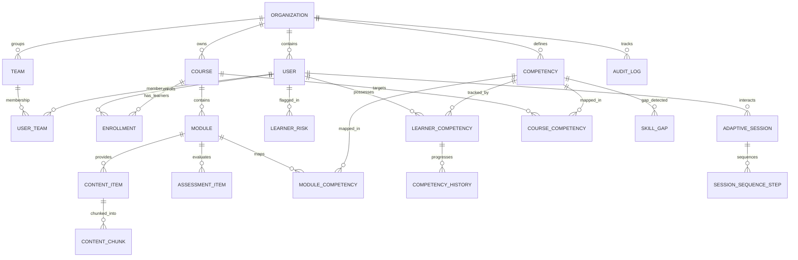

# Data Model Specification

> **Adaptive LMS with Deep Reporting AI**  
> Complete Relational & Vector Schema Reference (PostgreSQL 16)

---

## 1. Architectural Principles

1. **Strict Multi-Tenant Isolation:** Every primary entity (except global system entities) includes an indexed `org_id` column referencing `organizations(id)`. Cascading deletes on tenant boundaries guarantee zero data leakage or orphan records.
2. **UUID Primary Keys:** All tables use cryptographically secure UUIDv4 identifiers, preventing ID enumeration attacks and facilitating distributed data pipelines.
3. **Auditability:** Core tables track `created_at` and `updated_at` UTC timestamps. The `audit_logs` table provides an immutable regulatory compliance journal for all sensitive administrative actions.
4. **Hybrid Relational + Semi-Structured Storage:** PostgreSQL `JSONB` is leveraged for flexible schemas (AI prompt citations, test choices/options, unstructured metadata, risk factors) while retaining strict relational constraints on foreign keys and competencies.
5. **Portable Vector Store:** Vector embeddings are stored in `content_chunks` as structured float vectors with dual compatibility for native `pgvector` index operators and portable JSONB payloads.

---

## 2. Entity Relationship Diagram

---

## 3. Schema Catalog (25 Tables)

### A. Tenancy, Identity & Access

| Table | Description | Primary Key | Foreign Keys / Tenant Isolation |
| :--- | :--- | :--- | :--- |
| `organizations` | Tenant root container | `id` (UUID) | None |
| `users` | User credentials and profile | `id` (UUID) | `org_id` -> `organizations(id)` |
| `teams` | Functional cohorts / departments | `id` (UUID) | `org_id` -> `organizations(id)`, `manager_id` -> `users(id)` |
| `user_teams` | Many-to-many user-team mappings | `(user_id, team_id)` | `user_id` -> `users(id)`, `team_id` -> `teams(id)` |
| `audit_logs` | Compliance action audit trail | `id` (UUID) | `org_id` -> `organizations(id)`, `user_id` -> `users(id)` |

### B. Curriculum & Content

| Table | Description | Primary Key | Foreign Keys / Tenant Isolation |
| :--- | :--- | :--- | :--- |
| `courses` | Top-level courses | `id` (UUID) | `org_id` -> `organizations(id)`, `created_by_id` -> `users(id)` |
| `modules` | Sequenced learning modules | `id` (UUID) | `org_id`, `course_id` -> `courses(id)` |
| `content_items` | Pedagogical assets (text, video, slides) | `id` (UUID) | `org_id`, `module_id` -> `modules(id)` |
| `content_chunks` | Tokenized text chunks with embeddings | `id` (UUID) | `org_id`, `content_item_id` -> `content_items(id)` |

### C. Competencies & Mastery Tracking

| Table | Description | Primary Key | Foreign Keys / Tenant Isolation |
| :--- | :--- | :--- | :--- |
| `competencies` | Hierarchical skill taxonomy | `id` (UUID) | `org_id`, `parent_id` -> `competencies(id)` |
| `course_competencies` | Target competencies per course | `(course_id, competency_id)` | `course_id`, `competency_id` |
| `module_competencies` | Weighted competency contribution | `(module_id, competency_id)` | `module_id`, `competency_id` |
| `learner_competencies` | Real-time estimated mastery & confidence | `id` (UUID) | `org_id`, `user_id` -> `users(id)`, `competency_id` -> `competencies(id)` |
| `competency_history` | Historical timeline of mastery changes | `id` (UUID) | `learner_competency_id` -> `learner_competencies(id)` |
| `skill_gaps` | Identified deficits (learner / team / cohort) | `id` (UUID) | `org_id`, `user_id`, `team_id`, `competency_id` |

### D. Assessment & Adaptive Sequencing

| Table | Description | Primary Key | Foreign Keys / Tenant Isolation |
| :--- | :--- | :--- | :--- |
| `assessment_items` | Question bank with IRT parameters | `id` (UUID) | `org_id`, `module_id`, `competency_id` |
| `enrollments` | Learner progress across courses | `id` (UUID) | `org_id`, `user_id`, `course_id` |
| `adaptive_sessions` | Real-time session state | `id` (UUID) | `org_id`, `user_id`, `course_id`, `current_module_id` |
| `session_sequence_steps` | Steps dynamically sequenced by AI engine | `id` (UUID) | `session_id` -> `adaptive_sessions(id)` |

### E. Events, Risks, Reporting & Ingestion

| Table | Description | Primary Key | Foreign Keys / Tenant Isolation |
| :--- | :--- | :--- | :--- |
| `learning_events` | Granular telemetry events | `id` (UUID) | `org_id`, `user_id`, `session_id`, `course_id`, `module_id` |
| `learner_risks` | Disengagement / dropout risk flags | `id` (UUID) | `org_id`, `user_id`, `course_id` |
| `ai_insights` | Grounded AI reports with citations | `id` (UUID) | `org_id`, `scope_id` |
| `scheduled_reports` | Automated report delivery schedules | `id` (UUID) | `org_id` |
| `report_digests` | Delivery history of scheduled reports | `id` (UUID) | `org_id`, `scheduled_report_id` |
| `ingestion_jobs` | Asynchronous file ingestion pipelines | `id` (UUID) | `org_id`, `module_id`, `created_by_id` |

---

## 4. Key Indexes & Performance Constraints

- **Multi-Tenant Filter Performance:** All primary business tables have a composite or dedicated B-Tree index on `org_id`.
- **Unique Slugs & Codes:** `organizations(slug)` and `courses(org_id, code)` are uniquely indexed.
- **Lookup Optimization:**
  - `users(org_id, email)` unique index for fast authentication.
  - `learner_competencies(user_id, competency_id)` unique constraint to ensure atomic upserts during event stream processing.
  - `learning_events(org_id, timestamp DESC)` for fast time-series analytical aggregation.
  - `content_chunks(content_item_id, chunk_index)` for ordered text reconstruction.
