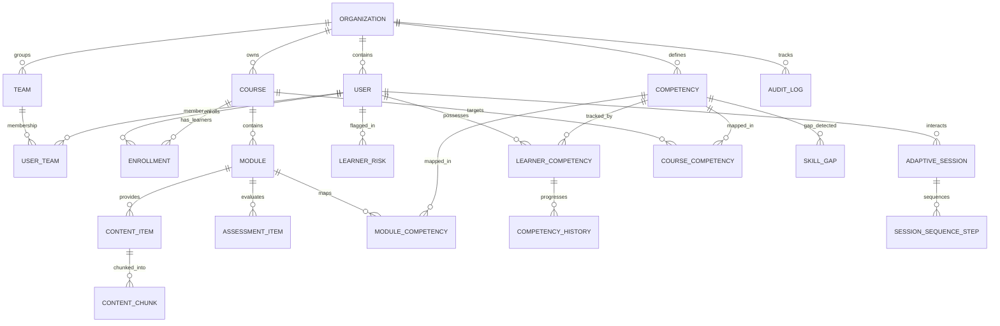

# Data Model Specification

> **Adaptive LMS with Deep Reporting AI**  
> Complete Relational & Vector Schema Reference (PostgreSQL 16)

---

## 1. Architectural Principles

1. **Strict Multi-Tenant Isolation:** Every primary entity (except global system entities) includes an indexed `org_id` column referencing `organizations(id)`. Cascading deletes on tenant boundaries guarantee zero data leakage or orphan records.
2. **UUID Primary Keys:** All tables use cryptographically secure UUIDv4 identifiers, preventing ID enumeration attacks and facilitating distributed data pipelines.
3. **Auditability:** Core tables track `created_at` and `updated_at` UTC timestamps. The `audit_logs` table provides an immutable regulatory compliance journal for all sensitive administrative actions.
4. **Hybrid Relational + Semi-Structured Storage:** PostgreSQL `JSONB` is leveraged for flexible schemas (AI prompt citations, test choices/options, unstructured metadata, risk factors) while retaining strict relational constraints on foreign keys and competencies.
5. **Portable Vector Store:** Vector embeddings are stored in `content_chunks` as structured float vectors with dual compatibility for native `pgvector` index operators and portable JSONB payloads.

---

## 2. Entity Relationship Diagram

---

## 3. Schema Catalog (25 Tables)

### A. Tenancy, Identity & Access

| Table | Description | Primary Key | Foreign Keys / Tenant Isolation |
| :--- | :--- | :--- | :--- |
| `organizations` | Tenant root container | `id` (UUID) | None |
| `users` | User credentials and profile | `id` (UUID) | `org_id` -> `organizations(id)` |
| `teams` | Functional cohorts / departments | `id` (UUID) | `org_id` -> `organizations(id)`, `manager_id` -> `users(id)` |
| `user_teams` | Many-to-many user-team mappings | `(user_id, team_id)` | `user_id` -> `users(id)`, `team_id` -> `teams(id)` |
| `audit_logs` | Compliance action audit trail | `id` (UUID) | `org_id` -> `organizations(id)`, `user_id` -> `users(id)` |

### B. Curriculum & Content

| Table | Description | Primary Key | Foreign Keys / Tenant Isolation |
| :--- | :--- | :--- | :--- |
| `courses` | Top-level courses | `id` (UUID) | `org_id` -> `organizations(id)`, `created_by_id` -> `users(id)` |
| `modules` | Sequenced learning modules | `id` (UUID) | `org_id`, `course_id` -> `courses(id)` |
| `content_items` | Pedagogical assets (text, video, slides) | `id` (UUID) | `org_id`, `module_id` -> `modules(id)` |
| `content_chunks` | Tokenized text chunks with embeddings | `id` (UUID) | `org_id`, `content_item_id` -> `content_items(id)` |

### C. Competencies & Mastery Tracking

| Table | Description | Primary Key | Foreign Keys / Tenant Isolation |
| :--- | :--- | :--- | :--- |
| `competencies` | Hierarchical skill taxonomy | `id` (UUID) | `org_id`, `parent_id` -> `competencies(id)` |
| `course_competencies` | Target competencies per course | `(course_id, competency_id)` | `course_id`, `competency_id` |
| `module_competencies` | Weighted competency contribution | `(module_id, competency_id)` | `module_id`, `competency_id` |
| `learner_competencies` | The competency **state**, one row per learner and competency: mastery, confidence, effective evidence, correct / incorrect / retry counts, recent accuracy, time on task, error distribution, trend (from history), links to the latest evidence and update. `basis` is `evidence` or `legacy_unverified` (numbers written by the earlier engine: kept, never shown) | `id` (UUID); unique `(org_id, user_id, competency_id)` | `org_id`, `user_id` -> `users(id)`, `competency_id` -> `competencies(id)`; check: mastery and confidence in 0..1 |
| `evidence_records` | **Immutable.** One row per graded answer or graded work: signal, source confidence, error type, evidence quote, difficulty, attempt number, response time, guess floor, when it happened, and where it came from (event, answer, submission). `source_type`: `question_answered`, `answer_graded`, `assignment_graded`, `seed_history` | `id` (UUID); unique `(source_event_id, competency_id)` where the event is set | composite `(competency_id, org_id)` -> `competencies(id, org_id)`; `user_id`, `source_event_id` -> `learning_events`, `response_id`, `submission_id` |
| `competency_state_updates` | **Immutable.** The audit trail: sequence, previous and new mastery and confidence, signal, weight, method (`bkt_soft_v1`), the parameters used, a note | `id` (UUID); unique `(state_id, sequence)`, unique `evidence_id` | `state_id` -> `learner_competencies`, `evidence_id` -> `evidence_records`, composite tenant key to `competencies` |
| `grading_results` | **Immutable.** Each grading act on a written answer: source (`ai` or `human`), status (`accepted` / `needs_review`), provider, model, prompt version, signal, confidence, error type, quote and whether it was verified, rubric scores, feedback, why it was held, reviewer, latency | `id` (UUID) | `org_id`, `response_id` -> `question_responses`, `graded_by_id` |
| `competency_history` | Legacy timeline written by the earlier engine. Nothing writes or reads it any more; `competency_state_updates` replaces it | `id` (UUID) | `learner_competency_id` -> `learner_competencies(id)` |
| `skill_gaps` | Identified deficits (learner / team / cohort) | `id` (UUID) | `org_id`, `user_id`, `team_id`, `competency_id` |

### D. Assessment & Adaptive Sequencing

| Table | Description | Primary Key | Foreign Keys / Tenant Isolation |
| :--- | :--- | :--- | :--- |
| `assessment_items` | Question bank with IRT parameters | `id` (UUID) | `org_id`, `module_id`, `competency_id` |
| `enrollments` | Learner progress across courses | `id` (UUID) | `org_id`, `user_id`, `course_id` |
| `adaptive_sessions` | The adaptive engine's working state (events now reference `learning_sessions`; unified in Phase 6) | `id` (UUID) | `org_id`, `user_id`, `course_id`, `current_module_id` |
| `session_sequence_steps` | Steps dynamically sequenced by AI engine | `id` (UUID) | `session_id` -> `adaptive_sessions(id)` |

### E. Events, Risks, Reporting & Ingestion

| Table | Description | Primary Key | Foreign Keys / Tenant Isolation |
| :--- | :--- | :--- | :--- |
| `learning_events` | Append-only evidence (database trigger rejects UPDATE/DELETE); references derived server-side; per-tenant idempotency key | `id` (UUID) | `org_id`, `user_id`, composite `(session_id, org_id, user_id)` -> `learning_sessions`, `course_id`, `module_id`, `content_id`, `assessment_id`, `question_id`, `competency_id` (all restricted, none cascade) |
| `learning_sessions` | A period of learning: `started_at`, `last_activity_at`, `ended_at`, `end_reason`, `context`; one open per learner per course | `id` (UUID) | `org_id`, `user_id`, `course_id` |
| `event_outbox` | Events awaiting delivery to the Redis stream, with attempts and last error | `event_id` (UUID) | `event_id` -> `learning_events(id)` |
| `learner_risks` | Disengagement / dropout risk flags | `id` (UUID) | `org_id`, `user_id`, `course_id` |
| `ai_insights` | Grounded AI reports with citations | `id` (UUID) | `org_id`, `scope_id` |
| `scheduled_reports` | Automated report delivery schedules | `id` (UUID) | `org_id` |
| `report_digests` | Delivery history of scheduled reports | `id` (UUID) | `org_id`, `scheduled_report_id` |
| `ingestion_jobs` | Background ingestion runs: source, status, per-stage log (`stages` JSON), error code, attempts | `id` (UUID) | `org_id`, `module_id`, `content_item_id`, `created_by_id` |
| `question_candidates` | AI-drafted or hand-written questions awaiting review, each with its source quote; published into `quiz_questions` | `id` (UUID) | `org_id`, `content_item_id` (composite `(id, org_id)`), `competency_id`, `published_question_id` |

---

## 4. Key Indexes & Performance Constraints

- **Multi-Tenant Filter Performance:** All primary business tables have a composite or dedicated B-Tree index on `org_id`.
- **Unique Slugs & Codes:** `organizations(slug)` and `courses(org_id, code)` are uniquely indexed.
- **Lookup Optimization:**
  - `users(org_id, email)` unique index for fast authentication.
  - `learner_competencies(org_id, user_id, competency_id)` unique index (Phase 5); the row is locked (`FOR UPDATE`) while evidence is applied, so concurrent answers form one chain.
  - `evidence_records`, `competency_state_updates`, `grading_results` and `learning_events` are append-only: the trigger function `alms_append_only()` rejects UPDATE and DELETE.
  - `learning_events(org_id, timestamp DESC)` for fast time-series analytical aggregation.
  - `content_chunks(content_item_id, chunk_index)` for ordered text reconstruction.

### Phase 5 additions (migration `007_competency_engine`)

- `quiz_questions.expected_answer`, `.rubric`; `question_candidates.expected_answer`, `.rubric` (written questions; `question_type` is `multiple_choice`, `short_answer` or `open_ended`).
- `question_responses.grading_status` (`graded` | `needs_review`), `.score_fraction` (0..1, null while waiting), `.grading_result_id`; `quiz_attempts.grading_status`. An attempt with an answer waiting for a person is `needs_review`: provisional score, not passed.
- `learner_risks.risk_details` (JSONB): the structured reasons, `[{code, description, points, value, evidence_ids}]`.
- Existing `learner_competencies` rows are marked `basis = 'legacy_unverified'`; duplicates are resolved to the newest.
