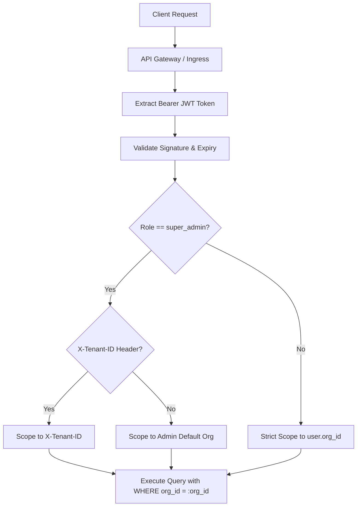

# Multi-Tenancy Architecture

> **Adaptive LMS with Deep Reporting AI**  
> Complete Architectural Reference for Multi-Tenant Isolation, Scoping, and Security Boundaries.

---

## 1. Tenancy Model Overview

The Adaptive LMS implements a **Shared Database, Shared Schema with Discriminator Column (`org_id`)** pattern. Every tenant is represented by an entity in the `organizations` table, with all business records strictly linked to that tenant via foreign keys with cascading deletes.



---

## 2. Tenant Resolution Flow

1. **Authentication:**
   - The user authenticates at `/api/v1/auth/login` by providing credentials (and optionally `org_slug`).
   - The API verifies that the user account is `is_active == True` and the user's organization is `is_active == True`.
   - A signed JWT token is issued containing the tenant identifier in its payload:
     ```json
     {
       "sub": "3fa85f64-5717-4562-b3fc-2c963f66afa6",
       "org_id": "7b134bb0-2e06-4fc6-b258-a9da1374b344",
       "role": "instructor",
       "email": "sarah.instructor@acme.com",
       "exp": 1789509600
     }
     ```

2. **Request Resolution ([deps.py](file:///d:/ALP-Deep_Report_AI/adaptive-lms/services/api/app/api/deps.py)):**
   - The `get_current_tenant` dependency enforces tenant boundaries:
     - For standard users (`org_admin`, `ld_admin`/`instructor`, `manager`, `learner`), the tenant is **unconditionally bound** to `current_user.org_id`. Any external request headers attempting to specify another tenant are ignored, and so is the `org_id` claim inside the JWT: the tenant comes from the user's database row, never from the client.
     - For global operators (`super_admin`/`system_admin`), passing `X-Tenant-ID: <uuid>` switches the operational scope to the target organization for cross-tenant administration, troubleshooting, and platform support.

3. **Database Scoping:**
   - Every read and write query on tenant-scoped tables enforces `table.org_id == tenant_ctx.org_id`.
   - Object lookups (e.g. `/api/v1/users/{user_id}`) verify that the target entity's `org_id` equals the caller's `org_id`. If they mismatch, a `404 Not Found` is returned rather than `403 Forbidden` to prevent tenant resource enumeration.

---

## 3. Roles

Role definitions, the compatibility column, assignment rules and the permission matrix live in [RBAC.md](RBAC.md).

---

## 4. Guarantees, by layer

| Layer | Guarantee |
|---|---|
| **Identity** | Tenant is derived from the authenticated user's row. `X-Tenant-ID` is honoured only for `super_admin`; forged `org_id` / `role` claims in a token are ignored |
| **Queries** | Every read and write on a tenant table filters `org_id == tenant_ctx.org_id` |
| **Lookups by id** | A resource in another tenant returns **404**, identical to a missing one, so ids cannot be probed across tenants |
| **Database (skill graph)** | Composite `(id, org_id)` foreign keys make a cross-tenant prerequisite edge impossible even from raw SQL — see [SKILL_GRAPH.md](SKILL_GRAPH.md) |
| **Role assignments** | `user_roles.org_id` keeps role grants tenant-owned; only a `super_admin` can grant `super_admin` |

Composite `(id, org_id)` foreign keys are the pattern to use for any new table that links two tenant-owned rows.

---

## 5. Isolation tests

`services/api/tests/foundation/integration/test_tenant_isolation.py` builds two fully populated tenants and, as tenant A's **org admin** (so a 404 can only come from tenant scoping, never a missing role), attempts to read, update, publish, enrol into, create under, link, or re-role 18 kinds of tenant-B resource. It also checks that listings never include B's rows, that spoofed headers and forged token claims do nothing, and that quizzes and events are not reachable across tenants.

`integration/test_ingestion_tenant_isolation.py` (Phase 3) does the same for the content admin API: tenant B ingests real content, then tenant A's org admin tries 16 requests against it (read, edit, reprocess, transcript, analysis, add/edit/status/delete question, publish, unpublish, delete, job status, upload or add a YouTube link into B's module). All are `404` and B's data is unchanged; the library and search never list B's items; a foreign competency cannot be attached to a question.

`integration/test_events_tenant_isolation.py` (Phase 4) covers events and sessions: tenant B's session, events, attempt and assignment cannot be read, ended, joined or written into by tenant A's admins, learners or managers; listings and statistics never include them; and a super admin reaches them only by naming the tenant. The event tables also enforce tenancy in the database: the composite key `(session_id, org_id, user_id)` makes an event pointing at another tenant's or learner's session impossible even from raw SQL.

The suite was mutation-checked: removing the tenant filter from one endpoint makes it fail. The ingestion tests were checked the same way in Phase 3: removing `org_id` from the content loader made 11 of the 20 fail, and restoring it made all pass.

`integration/test_competency_engine.py` (Phase 5) covers the competency engine: another tenant's admin gets `404` on a learner's states, gaps, explanation, verification and evidence, sees no cohort gaps, cannot read or review the answer queue, and cannot apply evidence for a foreign competency. Evidence and update tables carry a composite key `(competency_id, org_id)`, so a cross-tenant row is impossible from raw SQL too.

**Not yet covered** (the features are not in the API service; their tests ship with them): reports and their citations (Phase 7).

**Fixed in Phase 4:** the duplicate-event check that had no `org_id` filter (audit R7) is gone. Idempotency keys are unique per tenant in the database and prefixed per learner, and the strict `xfail` test that documented it now passes as `test_event_keys_do_not_collide_across_tenants`.

The older `tests/test_auth_rbac.py` (live-HTTP) additionally checks that `/users` for an Acme token returns only `@acme.com` users and that deactivating an organisation invalidates its sessions.
