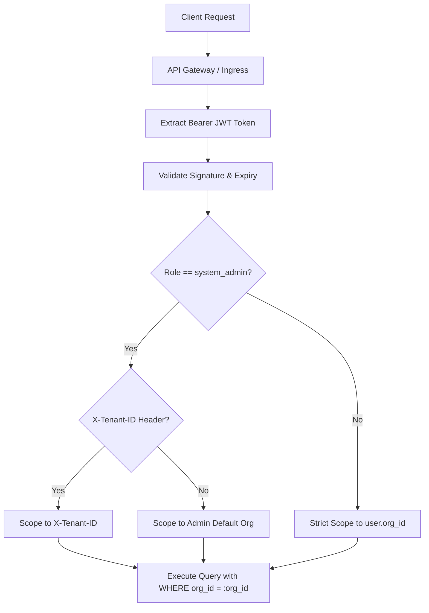

# Multi-Tenancy Architecture

> **Adaptive LMS with Deep Reporting AI**  
> Complete Architectural Reference for Multi-Tenant Isolation, Scoping, and Security Boundaries.

---

## 1. Tenancy Model Overview

The Adaptive LMS implements a **Shared Database, Shared Schema with Discriminator Column (`org_id`)** pattern. Every tenant is represented by an entity in the `organizations` table, with all business records strictly linked to that tenant via foreign keys with cascading deletes.



---

## 2. Tenant Resolution Flow

1. **Authentication:**
   - The user authenticates at `/api/v1/auth/login` by providing credentials (and optionally `org_slug`).
   - The API verifies that the user account is `is_active == True` and the user's organization is `is_active == True`.
   - A signed JWT token is issued containing the tenant identifier in its payload:
     ```json
     {
       "sub": "3fa85f64-5717-4562-b3fc-2c963f66afa6",
       "org_id": "7b134bb0-2e06-4fc6-b258-a9da1374b344",
       "role": "instructor",
       "email": "sarah.instructor@acme.com",
       "exp": 1789509600
     }
     ```

2. **Request Resolution ([deps.py](file:///d:/ALP-Deep_Report_AI/adaptive-lms/services/api/app/api/deps.py)):**
   - The `get_current_tenant` dependency enforces tenant boundaries:
     - For standard users (`org_admin`, `instructor`, `manager`, `learner`), the tenant is **unconditionally bound** to `current_user.org_id`. Any external request headers attempting to specify another tenant are ignored.
     - For global operators (`system_admin`), passing `X-Tenant-ID: <uuid>` switches the operational scope to the target organization for cross-tenant administration, troubleshooting, and platform support.

3. **Database Scoping:**
   - Every read and write query on tenant-scoped tables enforces `table.org_id == tenant_ctx.org_id`.
   - Object lookups (e.g. `/api/v1/users/{user_id}`) verify that the target entity's `org_id` equals the caller's `org_id`. If they mismatch, a `404 Not Found` is returned rather than `403 Forbidden` to prevent tenant resource enumeration.

---

## 3. Role-Based Access Control (RBAC) Matrix

| Role | Tenant Scope | Platform Scope | Permissions & Capabilities |
| :--- | :--- | :--- | :--- |
| **`system_admin`** | Any tenant via `X-Tenant-ID` | Global cross-tenant | Platform monitoring, tenant provisioning, system health, global analytics. |
| **`org_admin`** | Strictly caller's `org_id` | Single tenant | Organization settings, user provisioning, team management, compliance audit log access. |
| **`instructor`** | Strictly caller's `org_id` | Single tenant | Course authoring, module configuration, question bank management, grading, cohort review. |
| **`manager`** | Strictly caller's `org_id` | Single tenant | Team cohort tracking, skill gap monitoring, at-risk learner remediation, scheduled digests. |
| **`learner`** | Strictly caller's `org_id` | Single tenant | Course enrollment, content consumption, adaptive assessment taking, personal mastery review. |

---

## 4. Cross-Tenant Isolation Verification

Automated regression test suite [test_auth_rbac.py](file:///d:/ALP-Deep_Report_AI/adaptive-lms/services/api/tests/test_auth_rbac.py) validates isolation across all layers:

1. **Authentication Isolation:** Users cannot log in against inactive or mismatched organization slugs.
2. **Directory Isolation:** Querying `/api/v1/users` with an Acme Corp token returns exclusively `@acme.com` users. Querying with a TechNova token returns exclusively `@technova.com` users (0% cross-tenant contamination).
3. **Deactivation Boundary:** Deactivating an organization immediately invalidates all active sessions for all users belonging to that organization.
4. **Audit Immutability:** All authentication and administrative events are stamped with the caller's `org_id`, `user_id`, and client IP address in `audit_logs`.
